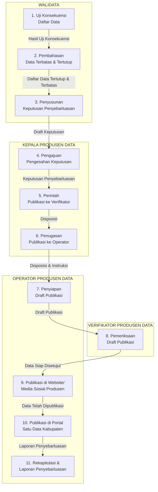
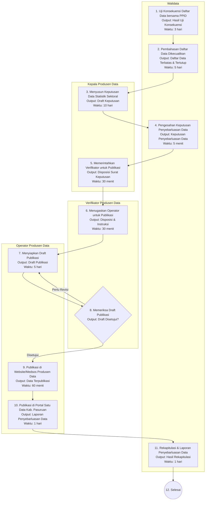
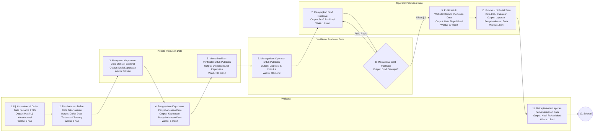

```mermaid
flowchart TD
    subgraph WALIDATA
        A1[1. Uji Konsekuensi<br/>Daftar Data]
        A2[2. Pembahasan<br/>Data Terbatas & Tertutup]
        A3[3. Penyusunan<br/>Keputusan Penyebarluasan]
    end

    subgraph KEPALA PRODUSEN DATA
        B4[4. Pengajuan<br/>Pengesahan Keputusan]
        B5[5. Perintah<br/>Publikasi ke Verifikator]
        B6[6. Penugasan<br/>Publikasi ke Operator]
    end

    subgraph VERIFIKATOR PRODUSEN DATA
        C8[8. Pemeriksaan<br/>Draft Publikasi]
    end

    subgraph OPERATOR PRODUSEN DATA
        D7[7. Penyiapan<br/>Draft Publikasi]
        D9[9. Publikasi di Website/<br/>Media Sosial Produsen]
        D10[10. Publikasi di Portal<br/>Satu Data Kabupaten]
        D11[11. Rekapitulasi &<br/>Laporan Penyebarluasan]
    end

    %% Alur Proses
    A1 -->|Hasil Uji Konsekuensi| A2
    A2 -->|Daftar Data Tertutup & Terbatas| A3
    A3 -->|Draft Keputusan| B4
    B4 -->|Keputusan Penyebarluasan| B5
    B5 -->|Disposisi| B6
    B6 -->|Disposisi & Instruksi| D7
    D7 -->|Draft Publikasi| C8
    C8 -->|Data Siap Disetujui| D9
    D9 -->|Data Telah Dipublikasi| D10
    D10 -->|Laporan Penyebarluasan| D11
```

# Diagram Swimlane

```mermaid
%% Diagram Swimlane Vertikal (Top to Bottom)
flowchart TD
    %% Swimlanes
    subgraph W["Walidata"]
        W1["1. Uji Konsekuensi Daftar Data bersama PPID<br/>Output: Hasil Uji Konsekuensi<br/>Waktu: 3 hari"]
        W2["2. Pembahasan Daftar Data Dikecualikan<br/>Output: Daftar Data Terbatas & Tertutup<br/>Waktu: 5 hari"]
        W4["4. Pengesahan Keputusan Penyebarluasan Data<br/>Output: Keputusan Penyebarluasan Data<br/>Waktu: 5 menit"]
        W11["11. Rekapitulasi & Laporan Penyebarluasan Data<br/>Output: Hasil Rekapitulasi<br/>Waktu: 1 hari"]
    end

    subgraph K["Kepala Produsen Data"]
        K3["3. Menyusun Keputusan Data Statistik Sektoral<br/>Output: Draft Keputusan<br/>Waktu: 10 hari"]
        K5["5. Memerintahkan Verifikator untuk Publikasi<br/>Output: Disposisi Surat Keputusan<br/>Waktu: 30 menit"]
    end

    subgraph V["Verifikator Produsen Data"]
        V6["6. Menugaskan Operator untuk Publikasi<br/>Output: Disposisi & Instruksi<br/>Waktu: 30 menit"]
        V8{"8. Memeriksa Draft Publikasi<br/>Output: Draft Disetujui?"}
    end

    subgraph O["Operator Produsen Data"]
        O7["7. Menyiapkan Draft Publikasi<br/>Output: Draft Publikasi<br/>Waktu: 5 hari"]
        O9["9. Publikasi di Website/Medsos Produsen Data<br/>Output: Data Terpublikasi<br/>Waktu: 60 menit"]
        O10["10. Publikasi di Portal Satu Data Kab. Pasuruan<br/>Output: Laporan Penyebarluasan Data<br/>Waktu: 1 hari"]
    end

    %% Alur antar-aktor
    W1 --> W2 --> K3 --> W4 --> K5 --> V6 --> O7 --> V8
    V8 -- "Disetujui" --> O9 --> O10 --> W11 --> End((12. Selesai))
    V8 -- "Perlu Revisi" --> O7
```

```mermaid
%% Diagram Swimlane - Walidata di kiri
flowchart LR
    %% WALIDATA
    subgraph W["Walidata"]
        direction TB
        W1["1. Uji Konsekuensi Daftar Data bersama PPID<br/>Output: Hasil Uji Konsekuensi<br/>Waktu: 3 hari"]
        W2["2. Pembahasan Daftar Data Dikecualikan<br/>Output: Daftar Data Terbatas & Tertutup<br/>Waktu: 5 hari"]
        W4["4. Pengesahan Keputusan Penyebarluasan Data<br/>Output: Keputusan Penyebarluasan Data<br/>Waktu: 5 menit"]
        W11["11. Rekapitulasi & Laporan Penyebarluasan Data<br/>Output: Hasil Rekapitulasi<br/>Waktu: 1 hari"]
    end

    %% KEPALA PRODUSEN DATA
    subgraph K["Kepala Produsen Data"]
        direction TB
        K3["3. Menyusun Keputusan Data Statistik Sektoral<br/>Output: Draft Keputusan<br/>Waktu: 10 hari"]
        K5["5. Memerintahkan Verifikator untuk Publikasi<br/>Output: Disposisi Surat Keputusan<br/>Waktu: 30 menit"]
    end

    %% VERIFIKATOR PRODUSEN DATA
    subgraph V["Verifikator Produsen Data"]
        direction TB
        V6["6. Menugaskan Operator untuk Publikasi<br/>Output: Disposisi & Instruksi<br/>Waktu: 30 menit"]
        V8{"8. Memeriksa Draft Publikasi<br/>Output: Draft Disetujui?"}
    end

    %% OPERATOR PRODUSEN DATA
    subgraph O["Operator Produsen Data"]
        direction TB
        O7["7. Menyiapkan Draft Publikasi<br/>Output: Draft Publikasi<br/>Waktu: 5 hari"]
        O9["9. Publikasi di Website/Medsos Produsen Data<br/>Output: Data Terpublikasi<br/>Waktu: 60 menit"]
        O10["10. Publikasi di Portal Satu Data Kab. Pasuruan<br/>Output: Laporan Penyebarluasan Data<br/>Waktu: 1 hari"]
    end

    %% ALUR ANTAR AKTOR
    W1 --> W2 --> K3 --> W4 --> K5 --> V6 --> O7 --> V8
    V8 -- "Disetujui" --> O9 --> O10 --> W11 --> End((12. Selesai))
    V8 -- "Perlu Revisi" --> O7
```
